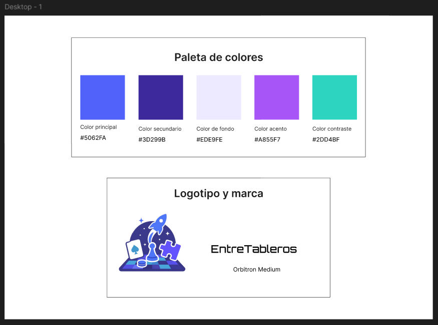
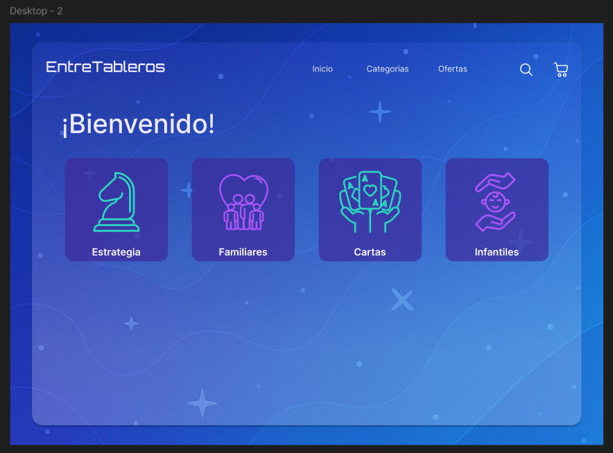

# 🌌 EntreTableros - Tienda de Juegos de Mesa

**EntreTableros** es una tienda ficticia de juegos de mesa con un diseño galáctico, moderno y amigable. Este proyecto fue desarrollado como parte de la asignatura *Desarrollo Full Stack II* para practicar estructura HTML, diseño CSS, responsividad y manipulación del DOM con JavaScript.

---

## 🎯 Objetivo

Ofrecer una experiencia visual atractiva y ordenada para que los usuarios puedan explorar juegos de mesa por categorías (Estrategia, Familiares, Cartas e Infantiles), y registrarse como compradores frecuentes.

---

## 🧩 Funcionalidades

- Carga dinámica de juegos desde `games.json` en una sola página (`category.html`)
- Navegación por categoría a través de parámetros en la URL (`?cat=...`)
- Formulario de registro validado con JavaScript
- Diseño responsivo con Bootstrap
- Estructura modular y ordenada

---

## 🎨 Proceso Creativo

El diseño se ideó en Figma y se documentó en la carpeta `/prototipo`, incluyendo:

- Paleta de colores principal
- Prototipo de página de inicio y tarjetas por categoría

---

### 📷 Vista del prototipo

#### 🎨 Paleta de colores


#### 🏠 Página de inicio


#### 🗂️ Tarjetas por categoría


---

## 🖼️ Diseño

- Colores galácticos: violeta, turquesa, blanco
- Tipografías: `Orbitron` (logo), `Inter` (contenido)
- Efectos translúcidos con fondo galáctico
- Responsividad mediante Bootstrap y Flexbox

---

## 📂 Estructura del Proyecto

```
EntreTableros/
├── index.html
├── category.html
├── register.html
├── games.json
├── styles.css
├── js/
│   ├── category.js
│   └── register.js
├── images/
│   ├── buscar.png
│   ├── carrito.png
│   └── ...iconos por categoría
├── games/
│   └── ...imagenes de juegos
└── prototipo/
    ├── paletaymarca.PNG
    ├── home.PNG
    └── categorias.png
```

---

## 📝 Validaciones en el formulario de registro (`register.html`)

- Todos los campos obligatorios excepto dirección
- Correo válido
- Contraseñas iguales, con una mayúscula, un número y longitud entre 6-18 caracteres
- Edad mínima: 13 años
- Validación visual con Bootstrap (`is-valid`, `is-invalid`)
- Botones de **Registrar** y **Limpiar**

---

## 💻 Tecnologías Usadas

- HTML5 + CSS3
- Bootstrap 5.3
- JavaScript (DOM, validaciones)
- Google Fonts

---

## ✅ Pendientes / Extensiones

- Página de “Ofertas”
- Carrito funcional
- Recomendador de juegos
- Integración con almacenamiento local

---

## 👩‍💻 Desarrollado por

Vanessa Suazo  
Proyecto académico – *Desarrollo Full Stack II* – 2025
